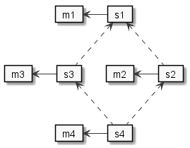
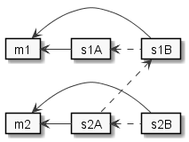
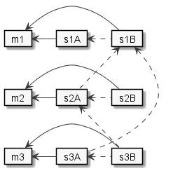
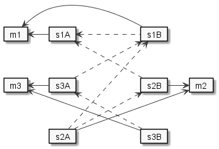

# Delivery Chain

The messages involved in the delivery and acknowledgment of a message logically form a chain. (If you are strict about it, the structure is a DAG.)
This structure is called a *delivery chain*.

## Structure

These structures are different depending on the type of message.
* *atom-specific* messages are only exchanged between an atom's owner and the WoN node (CREATE, DELETE, REPLACE, DEACTIVATE, ACTIVATE). They are stored in the atom's message container.
* *connection-specific* messages are exchanged between two atoms. Each atom maintains a *connection* entity for this communication channel. The messages are stored in each connection's message container.

In the following depictions, the arrows are labeled with their RDF property names.

In the case of an *atom-specific* message, it consists of the message `m` and the WoN node's success response `s`:
```
m <--msg:respondingTo-- s
```

In the case of a *connection-specific* message, it consists of the message `m` and the WoN node's success response `s1` as well as 
the recipient node's success response `s2`:
```
m <--msg:respondingTo-- s1
m <--msg:respondingTo-- s2
s1 <--msg:previousMessage-- s2
```

## Message Delivery
The following depictions show which messages are exchanged. `a => b : x, y` means `a` sends messages `x` and `y` to `b` *in one RDF dataset*. 

Atom-specific delivery: Simple in/out behavior:
```
owner -> node : m
owner <- node : m, s
```
Connection-specific delivery: Message `m` travels from `owner1` to `node1`, to `node2`, to `owner2`. The responses `s1` and `s2` are delivered to both `owner1` and `owner2`. The sequence is depicted in the following diagram.

```
1. owner => node1                    : m 
2. owner <= node1                    : m, s1
3.          node1 => node2           : m, s1
4.          node1 <= node2           : s2
5.                   node2 => owner2 : m, s1, s2
6. owner <= node1 :                  : s2
```                 
After these exchanges, both owners end up with `m`, `s1`, and `s2`.

Message 2 contains `m` and `s1`, not just `s1`, which might be surprising. In this case, `m` is called an *echo*, and it is delivered to all clients registered as the owner of the atom that sends `m`. Thus, when one client sends a message, all clients are informed of that message immediately.

## Message Log Integrity

Each message is content-addressed, i.e., its URI is calculated based on its entire content. It is thus not possible to change a message after calculating its URI without breaking this relationship. 

By referencing earlier messages in a conversation, the conversation becomes immutable in the sense that alteration of any part of it can be detected. Each message is also signed by its author, so no other participant could modify the contents without detection. In combination, only the last message in a conversation could be modified (and subsequently its URI recalculated) by one of the participants.

In WoN it is the responsibility of the WoN nodes to link new messages to earlier ones. They do this by adding message references to the SuccessResponses they generate. (FailureResponses are never used in this way). These references are realized using the RDF property 
`msg:previousMessage`, which always point to an earlier SuccessResponse. The actual user-generated (or system-generated) messages are referenced by those SuccessResponses. Thus, a SuccessResponse gets *confirmed*. 

The confirmation algorithm differs for an atom's message container and for a connection's message container.

### Atom's Message Container

An atom's message container only holds user-generated messages, system-generated messages, and the atom's responses.

#### Confirmation Algorithm

For each message container a *confirmation list* is maintained, which contains the URIs of those messages that have not been confirmed yet. 
* Each time a SuccessResponse is appended to the message container, the messages it confirms are removed from the confirmation list.
* Each time a SuccessResponse is created, all URIs in the confirmation list are added as `msg:previousMessage` properties. 

#### Examples


In this case, `m1`, `m2`, and `m3` were processed sequentially, therefore their SuccessResponses link up in a chain. 

When messages are processed in parallel, the chain forks. A subsequent SuccessResponse then contain references to multiple previous messages and thereby reunites the forked chains:




### Connection's Message Container

An connection's message container holds user-generated messages and system-generated messages from both atoms, as well as both atom's responses.

In this setting, confirmation is the mechanism to inform the communication partner of the receipt of one of their responses. Once we know that our response was received by our partner, we know that we both have all messages of that delivery chain in our message containers.

#### Confirmation Algorithm

For each message container a *confirmation list* `C` is maintained, which contains the URIs of those messages that have not been confirmed yet. 
* Each time a SuccessResponse `s` from the other connection is appended to the message container
    - The messages it confirms transitively are removed from the confirmation list:
        + load all messages referenced by `s` via `msg:previousMessage` - these are our responses 
        + extract from them the URIs *they* reference via `msg:previousMessage` and remove them from `C`
    - `s` is added to `C`
* Each time a SuccessResponse is created, all URIs in the confirmation list are added as `msg:previousMessage` properties. 

Simply put, we confirm our partner's SuccessResponse `s` until we receive a SuccessResponse `s'` that confirms one of our messages that confirms `s`.

#### Examples

In the following examples, `A` denotes the connection of the atom on the left side, `B` denotes the connection of the atom on the right side. `s1A` is the SuccessResponse from `A`, in response to message `m1`, `s1B`is the response of `B`, and so on.

##### Example 1: one message from each side


After the first delivery chain is *finished* (both responses are present), `s1A` is in `C(B)` and `s1B` is in `c(A)`. In the second delivery chain, when `B` confirms `s1A` it is actually the second time it refrences it. `B` must do that because `s1B` might have been lost or delayed. `A` confirms `s1B` because it is its first chance to do so.

##### Example 2: two messages from the same side



After the first delivery chain is finished, as in the first example, `s1A` is in `C(B)` and `s1B` is in `c(A)`. However, now the message comes from the owner of `A`. The difference is the order in which `s2A` and `s2B` are created: `s2A` confirms `s1B`, which, according to the algorithm, removes `s1A` from `C(B)`. Therefore, `s2B` only references `s2A` - which, upon receipt by `A` removes `s1B` from `C(A)`.

##### Example 3: lost response



This example is a possible continuation of  Example 2, in which `s2B` is late or lost. The consequence is that `s1B` is not removed from `C(A)`. When `A` creates the response `s3A`, it therefore references `s1B` again. The lost response also causes `s3B` to reference `s2A` again. Only when `A` actually receives `s3B` will `s1B` be removed from `C(A)`.

##### Example 4: two simultaneous messages



Here, `m2` and `m3` are sent roughly the same time, such that they are both processed by the sending node before they are both processed by the receiving node. Their delivery chains do not influence each other. After this exchange, `C(A) = {s2B, s3B}`,  `C(B) = {s2A, s3A}`. 
                          

